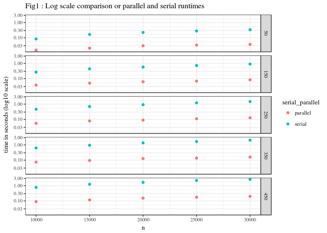
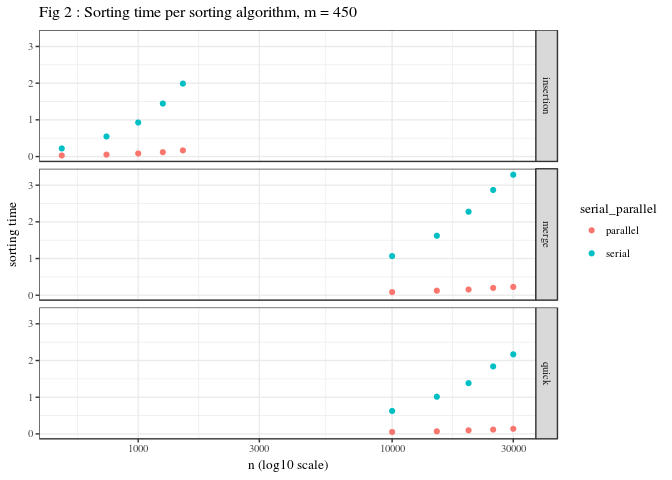

Brute force KNN parallelisation experiment
================
Marc van Heerden (1769865)
3/8/2018

Overview
--------

K nearest neighbours is a commonly used algorithm that can be used for regression or classification. For this experiment we use the regression version of the algorithm. For a given problem there are n reference points and q query points. For a given integer k, the estimated value for a query point is given as the average value of the k nearest reference points.

There are various ways to compute the estimated values, in this report we attempt to improve the brute force method with parallelisation of the distance calculation and sorting calculation.

Parallelisation
---------------

### Foster's methodology

The distance calculation involves calculating the distances from each of the query points to each of the reference points. We partition this problem into the fine-grained task of calculating the distance from one query point to all the reference points. There is no communication needed between the partitions. We agglomerate these tasks into roughly equal groups, the number of groups is equal to the number of available processors.

The sorting calculation involves sorting distance vectors that result from the distance calculation in order to find the k closest points to each query point. We partition this problem into the fine-grained task of sorting one query point's distance vector. There is no communication needed between the partitions. Once again we agglomerate these tasks into roughly equal groups, the number of groups is equal to the number of available processors.

### Results

The experiment was performed with multiple sorting functions and distance functions. For this section we analyse the results from the quicksort algorithm and euclidean distance. Table 1 and 2 below show the proportion of the run time spent on the distance calculation and on the sorting calculation. It can be seen the the proportion of time spent on calculating the distance decreases as n increases. This is due to the higher complexity of the sorting algorithm. It can also be seen that the distance calculation has a higher proportion of the total time for the parallel algorithm compared to the serial algorithm.

|      n|  distance\_time\_proportion|  sorting\_time\_proportion|  total\_time\_seconds|
|------:|---------------------------:|--------------------------:|---------------------:|
|  10000|                       0.195|                      0.805|                 0.777|
|  15000|                       0.176|                      0.818|                 1.239|
|  20000|                       0.167|                      0.838|                 1.652|
|  25000|                       0.164|                      0.836|                 2.199|
|  30000|                       0.166|                      0.840|                 2.582|

|      n|  distance\_time\_proportion|  sorting\_time\_proportion|  total\_time\_seconds|
|------:|---------------------------:|--------------------------:|---------------------:|
|  10000|                       0.411|                      0.594|                 0.090|
|  15000|                       0.388|                      0.611|                 0.116|
|  20000|                       0.346|                      0.644|                 0.151|
|  25000|                       0.327|                      0.673|                 0.175|
|  30000|                       0.301|                      0.704|                 0.199|

We define the speed up factor as the serial runtime divided by the parallel runtime. Table 3 below compares the serial and parallel runtimes for m = 450 and various n values. It can be seen that the speed up factor increase as n increases.

|      n|   parallel|     serial|  speed\_up\_factor|
|------:|----------:|----------:|------------------:|
|  10000|  0.0896280|  0.7770425|               8.67|
|  15000|  0.1156570|  1.2388820|              10.71|
|  20000|  0.1513910|  1.6519840|              10.91|
|  25000|  0.1753050|  2.1990970|              12.54|
|  30000|  0.1986925|  2.5820275|              13.00|

Figure 1 shows the comparative run times of the serial and parallel algorithms for various values of m and n. The y-axis uses a log base 10 scale due to the vastly different scales of the parallel and serial algorithms. It can be seen that parallelisation consistently and significantly improves the run times. 

Sorting algorithms
------------------

Insertion sort was significantly slower than mergesort and quicksort. Consequently, insertion sort was run on n values that were 5% of the n values run for mergesort and quicksort.

Quicksort was faster than merge sort for all n and in the serial and parallel runs.

| sort\_function | serial\_parallel |   n=10000|    n=15000|    n=20000|   n=25000|    n=30000|
|:---------------|:-----------------|---------:|----------:|----------:|---------:|----------:|
| merge          | parallel         |  0.085798|  0.1243610|  0.1557190|  0.198747|  0.2275625|
| merge          | serial           |  1.066941|  1.6214955|  2.2758460|  2.868114|  3.2838765|
| quick          | parallel         |  0.053246|  0.0706635|  0.0974515|  0.117997|  0.1398360|
| quick          | serial           |  0.625227|  1.0134255|  1.3837015|  1.838917|  2.1684655|

System specifications
---------------------

|              |                                                      |
|:-------------|:-----------------------------------------------------|
| sysname      | Linux                                                |
| release      | 4.13.0-36-generic                                    |
| version      | \#40~16.04.1-Ubuntu SMP Fri Feb 16 23:25:58 UTC 2018 |
| architecture | x86\_64                                              |
| cpu(s)       | 32                                                   |
| model name   | Intel(R) Xeon(R) CPU E5-2630 v3 @ 2.40GHz            |
